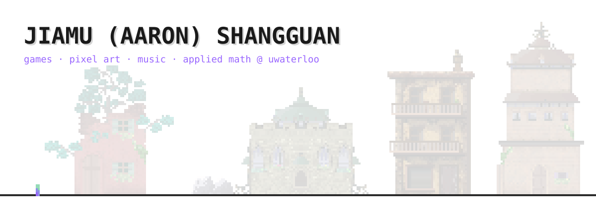
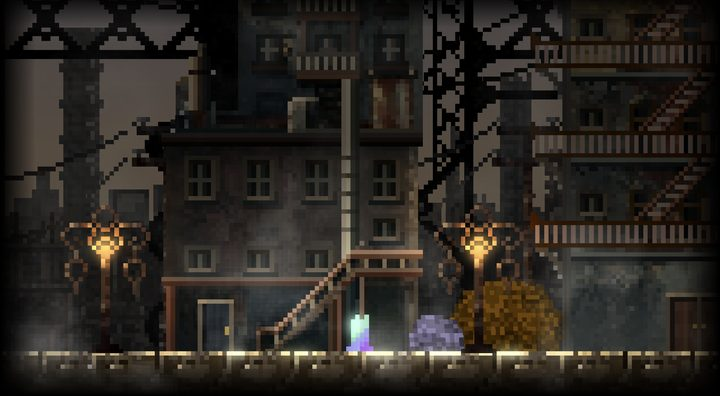
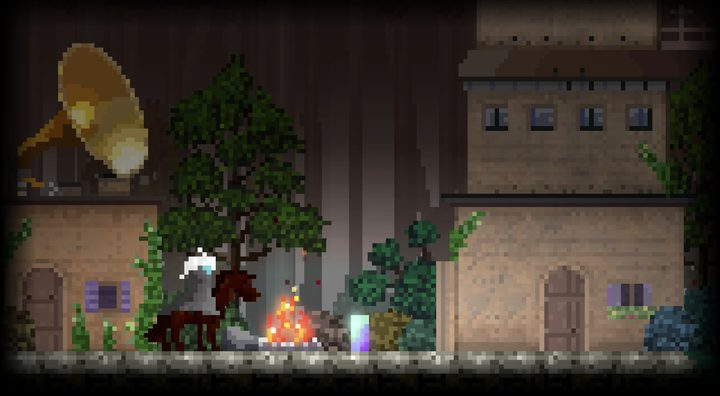

  

  

**Hi, I'm Mumu (Jiamu Shangguan).** I study Applied Math (Scientific Computing & Scientific ML) at the University of Waterloo and make games on my own in Godot: I write the code, draw the pixel art in Aseprite, and compose the music.

My main project is **[Phage](https://github.com/mu142857/Phage)**, a 2D action-adventure about a hero eight pixels tall crossing an enormous world. Its devlog series on [Bilibili](https://space.bilibili.com/1876827674) has 7,000 followers and 450K+ views, and fan-designed enemies have already shipped in the build.

  
  

**Also:** [Until Someone Passes](https://safari-mu.itch.io/until-someone-passes) (GMTK Game Jam 2026, #53 in Audio among 10,500+ entries) · [Open Prince George](https://github.com/mu142857/Open-PrinceGeorge) (civic tech: 342 council votes, each linked to the minutes) · Physics Simulation (1st place, Claude Create-A-Thon data-viz track) · LLM-agent evaluation at C-POLAR Technologies.

  
  
  
  
  

