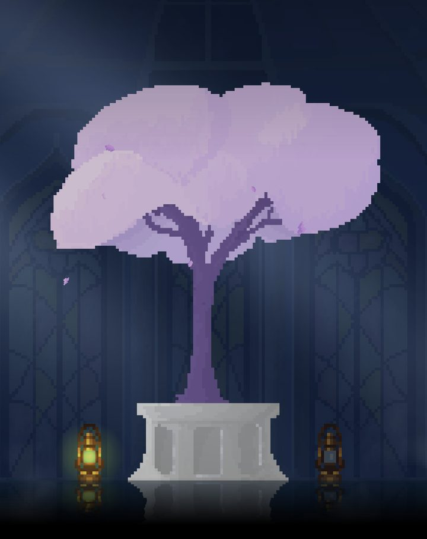
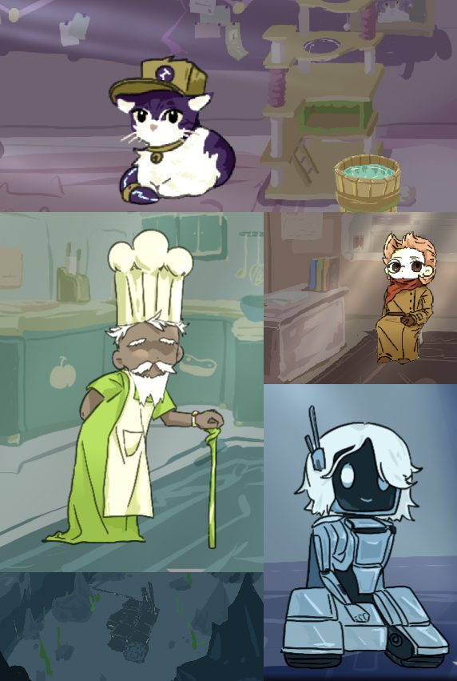

  

  

## Hi, I'm Mumu (Jiamu Shangguan) 👋

I'm a second-year **Applied Mathematics (Scientific Computing & Scientific ML)** student at the University of Waterloo, and an indie game developer. I build games in **Godot**: I write the code, draw the pixel art in Aseprite, and compose the soundtrack myself.

My main project is **[Phage](https://github.com/mu142857/Phage)**, a 2D action-adventure about a hero eight pixels tall crossing an enormous, strange world. I document it in a public devlog series on [Bilibili](https://space.bilibili.com/1876827674) (7,000 followers, 450K+ views), and the audience helps shape the game: fan-designed enemies have already shipped in the build.

Outside of games I like problems where data meets people: civic tech, evaluating LLM agents, and physics you can play with.

一个在滑铁卢大学读应用数学的独立游戏开发者：写代码、画像素、作曲，一个人把游戏做出来。

 

## 🎮 Games

<table>
  <tr>
    <td width="50%" valign="top">
      
       <b><a href="https://github.com/mu142857/Phage">Phage</a></b> · solo · in development
       2D fantasy action-adventure in Godot. Seven nights, seven dreams: multiple regions and bosses, a shield-and-buff combat system, an adaptive enemy that models your movement to intercept you, and touch controls for mobile. Custom pixel art and an original score.
    </td>
    <td width="50%" valign="top">
      
       <b>Phage</b> · Silvaron, the silver forest
       The whole point of the game is the contrast: a minuscule protagonist against atmospheric, cinematic environments.
    </td>
  </tr>
  <tr>
    <td width="50%" valign="top">
      
       <b><a href="https://safari-mu.itch.io/until-someone-passes">Until Someone Passes</a></b> · GMTK Game Jam 2026 · team lead & programmer
       A narrative game about social anxiety, made in 96 hours by a team of three. Ranked <b>#53 in Audio (top 0.5%)</b>, #126 in Narrative and #140 in Art among 10,500+ entries. I directed design and narrative, wrote all the GDScript, composed the score and drew half the pixel art.
    </td>
    <td width="50%" valign="top">
      
       <b><a href="https://maggieeeeem.itch.io/eight-for-long">Eight For Long</a></b> · GMTK Game Jam 2026
       A time-management puzzle game, #476 in Narrative among 10,500+ entries. Designed and programmed.
        <b><a href="https://github.com/mu142857/School-Rules">School Rules / 高三模拟器</a></b>
       An independent game set in an extreme Chinese high school: a pressure system, rule discovery, multiple endings. Godot 4.5.
        <b><a href="https://github.com/mu142857/TinyU">TinyU</a></b>
       A real-time campus simulation where 1,000 AI-driven students live, study and burn out through a semester.
    </td>
  </tr>
</table>

## 🧪 Other things I've built

- **[Open Prince George](https://github.com/mu142857/Open-PrinceGeorge)** · civic tech, solo. Profiles for all nine city councillors with 342 votes across 68 meetings, each linked to the official minutes; an issue-match quiz tied to real votes; a Python pipeline that harvested 3,048 council motions and a TF-IDF + linear-SVM classifier for tagging them (81.7% on a held-out set vs 63.3% for keyword rules).
- **Physics Simulation** · 1st place, Data Viz track, Claude Create-A-Thon 2026. Interactive Hooke's Law and pendulum-energy simulations with real-time visualization.
- **Loo-k** · Hack Canada 2026, team lead. A Leaflet amenity map with 3,702 OpenStreetMap/GTFS points, a density heatmap and 5/10/15-minute walk-time isochrones.
- **Sentiment Flow** · uOttaHack 8. Real-time facial-signal detection with MediaPipe and OpenCV, a Streamlit dashboard and the OpenAI API.
- **LLM agent evaluation** · as an AI Research Associate at C-POLAR Technologies I owned the evaluation loop for a deep-research agent benchmarked against DeepResearch Bench: rubric-based scoring, reproducible per-run records, and retrieval/synthesis changes that measurably improved the score.

## 🛠️ Tools I reach for

  
  
  
  
  
  
  
  
  
  

## 🎹 Beyond the desk

Ten-plus years of classical piano, and I write the music for my own games. Co-founder of [R&S Studio](https://r-s-studio.github.io/). Mandarin (native) and English (fluent).

## 📫 Find me

  
  
  
  
  

  
  

  
   
  <em>The little one above is the actual Phage player sprite: an animated SVG cut from the game's sprite sheet.</em>

