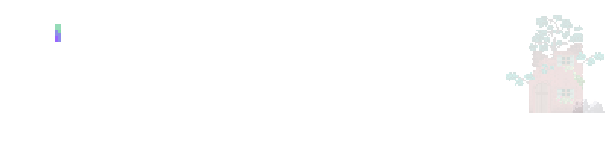
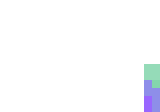
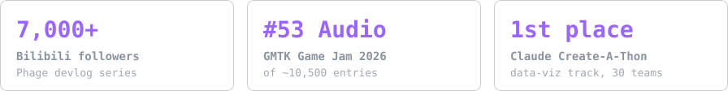

  

**Hi, I'm Mumu (Jiamu Shangguan).** I study Applied Mathematics with Scientific Computing and Scientific Machine Learning (AM-SciML) at the University of Waterloo. I build ML and simulation tools, and I make games on my own in Godot.

  

### Machine learning & simulation

**[WaveLens ↗](https://github.com/mu142857/WaveLens)** · Hack the North 2026 
Photograph the things on your desk and each one becomes an instrument in a band that never plays out of tune. Open-vocabulary detection picks out the objects; an FPGA keeps the beat. 
Python · YOLO-World · MediaPipe · Zybo Z7 FPGA

**[Physics Simulation ↗](https://github.com/mu142857/spring-oscillator-visualization)** · 1st place, Claude Create-A-Thon (data-viz track) 
Interactive spring–mass and pendulum systems with phase-space and energy views, ranked first among 30 teams. 
JavaScript · HTML Canvas

**Work:** LLM-agent evaluation at C-POLAR Technologies · drone-swarm formation simulation at AUAV (2024).

### Games

**[Phage ↗](https://github.com/mu142857/Phage)** · in development 
A 2D action-adventure about a hero eight pixels tall crossing an enormous world, every frame drawn by hand. Its devlog series on Bilibili has 7,000+ followers and 450K+ views, and fan-designed enemies have already shipped in the build. 
Godot · GDScript · Aseprite · original soundtrack

**[Until Someone Passes ↗](https://safari-mu.itch.io/until-someone-passes)** · GMTK Game Jam 2026 
A short game about social anxiety, made in four days. #53 worldwide in Audio among ~10,500 entries. I led the team of three, designed it, and wrote all the code. 
Godot · GDScript

**[Signal Split ↗](https://safari-mu.itch.io/signal-split)** · UW Game Jam 
A 2D platformer shipped in 72 hours: 4th overall, top score in Visuals. Sole programmer, and all the art. 
Godot · GDScript

 

  
  
  
  

